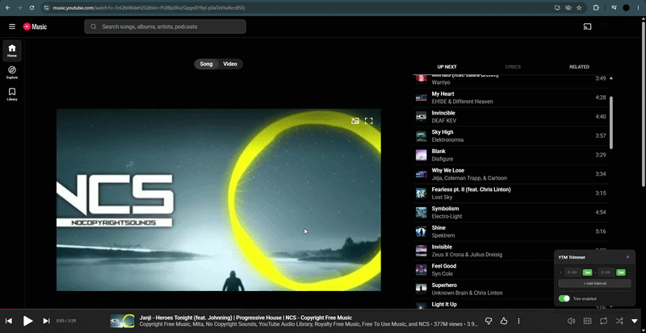
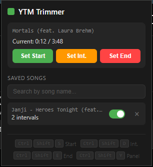
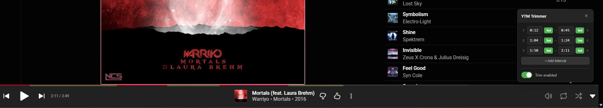

# YTM Trimmer

## Problem Statement
Have you ever listened to a song on YouTube Music and wished you could skip a long, drawn-out intro, or cut off a 2-minute silent outro? Maybe you only want to listen to a specific section of an hour-long mix. 

**YTM Trimmer** solves this problem by allowing you to set custom start and end times for *any* song on YouTube Music. Once set, the extension automatically seeks to your exact start point and stops playing right at your end point every time that song is played.

## Features
- **Custom Trims:** Set precise start and end times for any track.
- **Auto-Seek & Auto-Stop:** Automatically skips to your start time when a song begins and pauses exactly when it reaches your end time.
- **Interval Support:** Set custom interval boundaries within the track.
- **Seamless Integration:** Works quietly in the background on `music.youtube.com`.
- **In-Page Panel:** Access controls directly on the YouTube Music page with a quick shortcut.
- **Extension Popup:** Manage all your saved trims in one place. Toggle specific song trims on/off, search through your saved trims, and delete them when no longer needed.
- **Keyboard Shortcuts:** Quick, global shortcuts to set times on the fly without breaking your workflow.

## Screenshots & Demo

Here is the extension in action:

### Extension Interface

| Extension Popup UI | In-Page Trimming Panel |
| :---: | :---: |
|  |  |

## Installation (Unpacked)
Currently, this extension is available to install manually. This works for any Chromium-based browser like Google Chrome, Microsoft Edge, Opera, Brave, etc.

1. **Download the Extension:**
   - Clone this repository or download the ZIP file and extract it to a folder on your computer.
2. **Open Extensions Page:**
   - In your browser, go to `chrome://extensions/` (or `edge://extensions/`, `opera://extensions/` depending on your browser).
3. **Enable Developer Mode:**
   - Turn on the **Developer mode** toggle, usually located in the top right corner of the Extensions page.
4. **Load Unpacked:**
   - Click the **Load unpacked** button that appears.
5. **Select Folder:**
   - Select the folder where you extracted the YTM Trimmer files.
6. **Done!** The extension should now appear in your list of extensions. Pin it to your toolbar for easy access.

## Controls & Shortcuts
YTM Trimmer includes keyboard shortcuts for setting times instantly without clicking. 

*Note: You can use these while on the YouTube Music tab.*

| Action | Windows/Linux | Mac |
| :--- | :--- | :--- |
| **Set Start Time** | `Ctrl + Shift + S` | `Command + Shift + S` |
| **Set End Time** | `Ctrl + Shift + E` | `Command + Shift + E` |
| **Set Interval** | `Ctrl + Shift + D` | `Command + Shift + D` |
| **Toggle UI Panel** | `Ctrl + Shift + Y` | `Command + Shift + Y` |

You can also control trims by clicking the extension icon in your browser toolbar to open the **Popup**, where you can manage your saved songs and use the on-screen buttons to set times.
